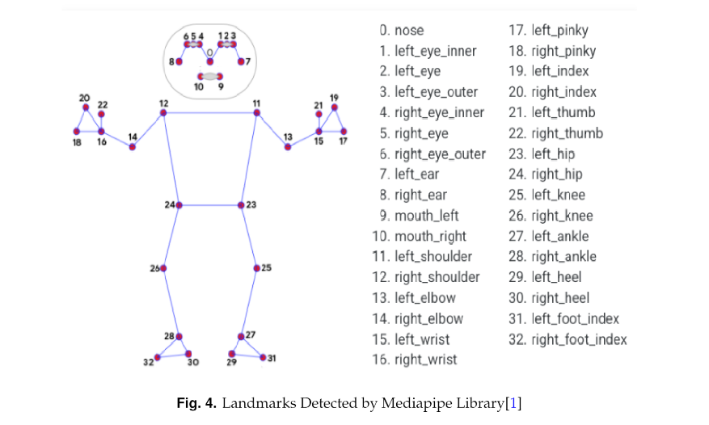
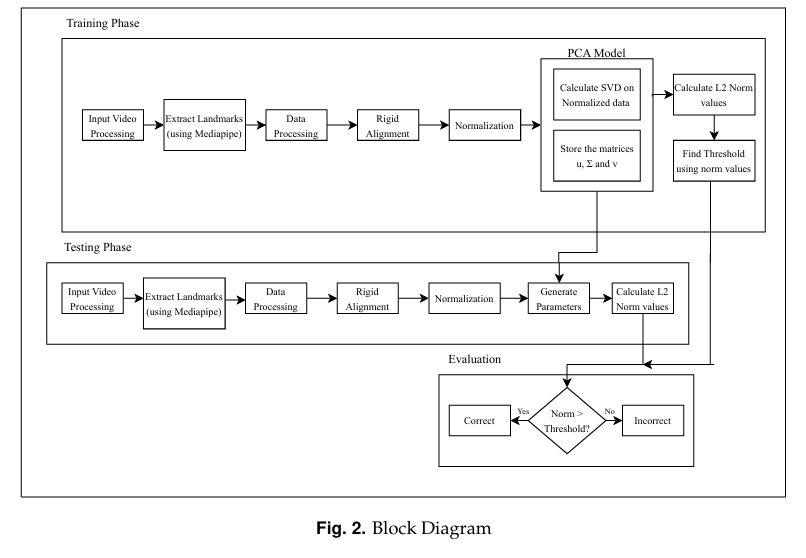
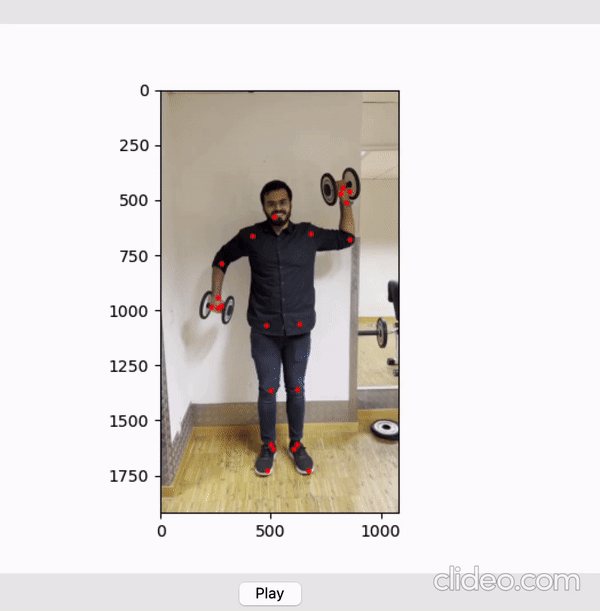

# Get Fit With PCA

### Abstract

In this project, we developed an automatic application to evaluate the correctness of user videos performing the dumbbell shoulder press exercise. We utilized a statistical modeling technique called Principal Component Analysis (PCA) for our analysis. Our system processes video frames to detect body landmarks using the MediaPipe library, aligns and normalizes these landmarks, and then computes a numerical score reflecting the accuracy of each frame. A predefined threshold determines whether the performance is correct. This model offers a low-data solution to exercise assessment, aimed at helping users perform exercises properly and effectively without needing a coach. Future enhancements include supporting additional exercises, non-frontal video processing, real-time performance analysis, and mobile application development.

### How It Works

1. **Video Input:** The user records a video of themselves performing the exercise.
2. **Landmark Detection:** The application processes each frame of the video using the MediaPipe library to extract 23 relevant body landmarks, which are stored in a CSV file.
3. **Data Preprocessing:** Rigid alignment is applied to all landmarks to ensure consistent positioning, and mean normalization is used to avoid outliers.
4. **Principal Component Analysis:** The mean-normalized data is used for PCA, calculating Eigenvectors and Eigenvalues to evaluate the correctness of the videos.
5. **Correctness Evaluation:** Each frame is analyzed to determine if the exercise is performed correctly.
6. **Scoring:** The application provides a numerical score indicating the accuracy of the exercise performance.

### Methodology

The system is divided into three main phases: Training, Testing, and Evaluation. This process is illustrated in the following block diagram.

#### Training Phase:
- **Input Video Processing:** Extract frames from training videos where the exercise is performed correctly.
- **Landmark Extraction:** Utilize the MediaPipe library to pinpoint 23 crucial landmarks on the body within each frame.
- **Data Processing:** Record these landmarks in a CSV file with 46 columns (x and y coordinates for each landmark).
- **Rigid Alignment:** Align all frames to a reference frame using the Kabsch Umeyama algorithm to ensure uniform orientation and positioning.
- **Normalization:** Compute the mean of the landmarks and subtract this mean from all frames to normalize the data.
- **Principal Component Analysis (PCA):** Apply PCA on the normalized data to reduce dimensionality and highlight the most significant features.
- **Threshold Calculation:** Establish a threshold to distinguish correct from incorrect frames based on the L2 norm values of the first 20 parameters derived from PCA.

#### Testing Phase:
- **Input Video Processing:** Similar to the training phase, extract frames from a test video.
- **Landmark Extraction:** Again, use MediaPipe to identify landmarks.
- **Data Processing and Normalization:** Align and normalize the landmarks.
- **Generate Parameters:** Use the PCA model (u and Σ matrices) to generate parameters for each test frame.
- **Calculate L2 Norm Values:** Compute the L2 norm values of the first 20 parameters for each frame.

#### Evaluation Phase:
- **Determine Correctness:** Compare the L2 norm values to the threshold. If the value exceeds the threshold, the frame is marked as incorrect; if it is below or equal to the threshold, the frame is marked as correct.

